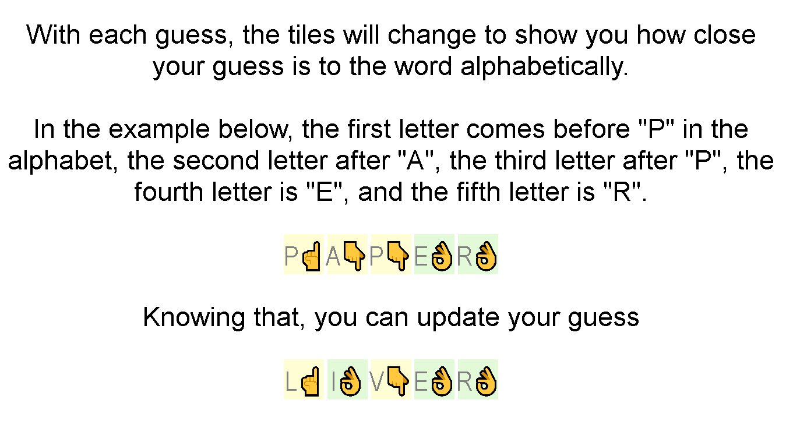
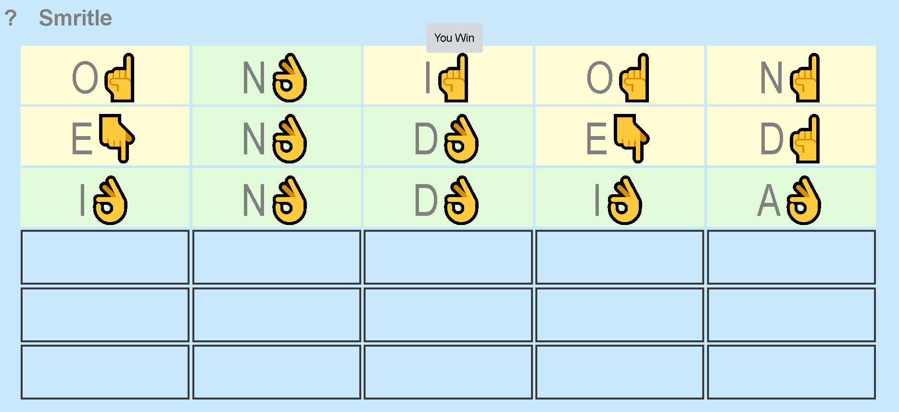

[Smritle](https://smritle.com) - A Wordle game made for my girlfriend, Smriti.

There is a new word to guess each day. It may be 4, 5, or 6 letters long. Proper nouns are included, and you can easily edit the word list to use specific words or simply pull from the dictionary.

Here is an example game:

I guessed "ONION" because each letter is close to the middle of the alphabet.

Because I got "N" correct, the first letter must be "A", "E", "I", or K (unlikely). I chose to try "E" since it's closest to half-way between "A" and "N" alphabetically. And I tried to make the other conditions work to create a valid word.

My third guess was straight-forward since I knew word starts with "IND" and the only other words I know are "INDEX" and "INDIE", neither or which meet the conditions from the second guess.

# Setup

Open the "index.html" file in a browser and play!

# Resources

https://github.com/WebDevSimplified/wordle-clone

- game logic and styling

https://github.com/ozboware/wordled

- help content, localstorage

https://html-online.com/articles/simple-popup-box/

- popup
